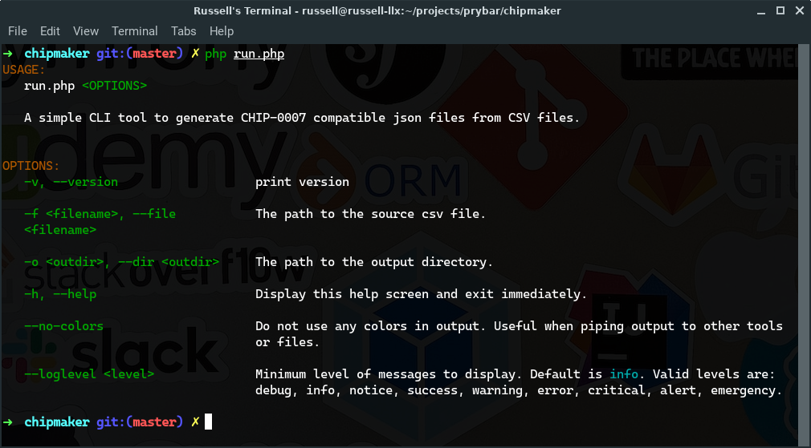

# CHIP-Maker

A simple CLI tool to generate CHIP-0007 compatible json files from CSV files.



## Installation

The app's dependencies are managed using composer. Make sure that the latest versions of [php](http://php.net) and [composer](https://getcomposer.org) are installed then run:

```bash
composer install
```

## Usage

To use the app first create a template file

```bash
cp template.json.example template.json
```

Here is the json file with the default values:

```jsonc
{
    "format": "CHIP-0007",
    "name": "Pikachu",
    "description": "Electric-type Pokémon with stretchy cheeks",
    "minting_tool": "SuperMinter/2.5.2",
    "sensitive_content": false,
    "series_number": 0,
    "series_total": 0,
    "attributes": [],
    "collection": {
        "name": "Example Pokémon Collection",
        "id": "e43fcfe6-1d5c-4d6e-82da-5de3aa8b3b57",
        "attributes": [
            {
                "type": "description",
                "value": "Example Pokémon Collection is the best Pokémon collection. Get yours today!"
            },
            {
                "type": "icon",
                "value": "https://examplepokemoncollection.com/image/icon.png"
            },
            {
                "type": "banner",
                "value": "https://examplepokemoncollection.com/image/banner.png"
            },
            {
                "type": "twitter",
                "value": "ExamplePokemonCollection"
            },
            {
                "type": "website",
                "value": "https://examplepokemoncollection.com/"
            }
        ]
    },
    "data": {}
}
```

After updating the template file with your information. Next run the application

```bash
php run.php -f file.csv -o ./output
```

Where `file.csv` is the source csv file and `./output` is the output directory.

**Below is a sample csv file**

> | Series Number | Filename    | Name        | Description           | Gender | UUID                           |
> | ------------- | ----------- | ----------- | --------------------- | ------ | ------------------------------ |
> | 1             | sample-file | Sample File | This is a sample file | male   | xxxxxx-xxxxx-xxxxxx-xxxxx-xxxx |

To display the help screen run

```php
php run.php
```

The generated files and their sha256 has would located in the `./output` directory. A new file `filename.output.csv` (where filename is the name of the source file) is created in the output directory. This file contains the contents of the source csv file and a new column `json_sha256` with the hash of the json corresponding json file.
